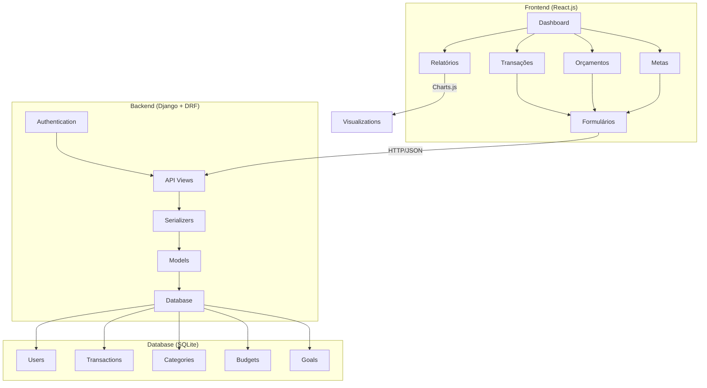
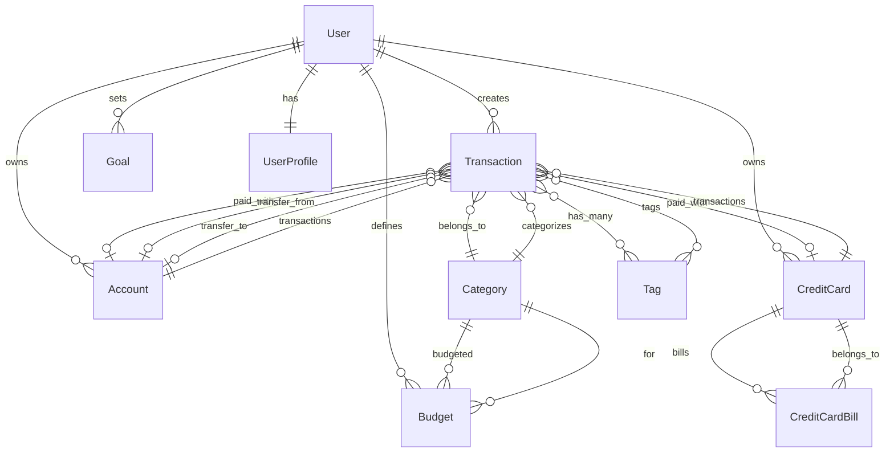

# Design - Nossa Grana

## Overview

O Nossa Grana é uma aplicação web full-stack que implementa uma arquitetura API-first com separação clara entre frontend e backend. O sistema utiliza Django REST Framework para APIs RESTful e React.js para interface responsiva, garantindo escalabilidade e manutenibilidade.

### Princípio de Paridade Frontend-Backend

O sistema segue o princípio de **paridade funcional completa** entre backend e frontend:
- Toda funcionalidade implementada no backend deve ter interface correspondente no frontend
- Todos os endpoints da API devem ser consumidos pela interface web
- Todos os campos, filtros e operações disponíveis na API devem estar acessíveis na interface
- A implementação deve ser simultânea: backend e frontend devem ser desenvolvidos em conjunto para cada funcionalidade

## Architecture

### Arquitetura Geral



### Stack Tecnológica

**Backend:**
- Python 3.9+
- Django 4.2+
- Django REST Framework 3.14+
- SQLite (desenvolvimento) / PostgreSQL (produção)
- JWT para autenticação
- Django CORS Headers

**Frontend:**
- React.js 18+
- Axios para requisições HTTP
- Chart.js para visualizações
- Material-UI para componentes
- React Router para navegação
- React Hook Form para formulários

**DevOps:**
- Docker para containerização
- Git para versionamento
- Pytest para testes backend
- Jest para testes frontend

## Components and Interfaces

### Backend Components

#### Models

**User Model (Django built-in estendido)**
```python
# Utiliza o User padrão do Django com campos adicionais via Profile
class UserProfile(models.Model):
    user = models.OneToOneField(User, on_delete=models.CASCADE)
    family_name = models.CharField(max_length=100)
    created_at = models.DateTimeField(auto_now_add=True)
```

**Transaction Model**
```python
class Transaction(models.Model):
    TRANSACTION_TYPES = [
        ('income', 'Receita'),
        ('expense', 'Despesa'),
    ]
    
    user = models.ForeignKey(User, on_delete=models.CASCADE)
    type = models.CharField(max_length=10, choices=TRANSACTION_TYPES)
    amount = models.DecimalField(max_digits=10, decimal_places=2)
    description = models.CharField(max_length=200)
    category = models.ForeignKey('Category', on_delete=models.CASCADE)
    date = models.DateField()
    tags = models.ManyToManyField('Tag', blank=True)
    created_at = models.DateTimeField(auto_now_add=True)
    updated_at = models.DateTimeField(auto_now=True)
```

**Category Model**
```python
class Category(models.Model):
    name = models.CharField(max_length=50, unique=True)
    color = models.CharField(max_length=7, default='#007bff')  # Hex color
    icon = models.CharField(max_length=50, default='category')
    is_default = models.BooleanField(default=False)
```

**Budget Model**
```python
class Budget(models.Model):
    user = models.ForeignKey(User, on_delete=models.CASCADE)
    category = models.ForeignKey(Category, on_delete=models.CASCADE)
    amount = models.DecimalField(max_digits=10, decimal_places=2)
    month = models.DateField()  # Primeiro dia do mês
    created_at = models.DateTimeField(auto_now_add=True)
    
    class Meta:
        unique_together = ['user', 'category', 'month']
```

**Goal Model**
```python
class Goal(models.Model):
    user = models.ForeignKey(User, on_delete=models.CASCADE)
    name = models.CharField(max_length=100)
    target_amount = models.DecimalField(max_digits=10, decimal_places=2)
    current_amount = models.DecimalField(max_digits=10, decimal_places=2, default=0)
    target_date = models.DateField()
    created_at = models.DateTimeField(auto_now_add=True)
    achieved = models.BooleanField(default=False)
```

**Account Model**
```python
class Account(models.Model):
    ACCOUNT_TYPES = [
        ('checking', 'Conta Corrente'),
        ('savings', 'Poupança'),
        ('investment', 'Investimento'),
        ('cash', 'Dinheiro'),
    ]
    
    user = models.ForeignKey(User, on_delete=models.CASCADE)
    name = models.CharField(max_length=100)
    type = models.CharField(max_length=20, choices=ACCOUNT_TYPES)
    bank = models.CharField(max_length=100, blank=True)
    initial_balance = models.DecimalField(max_digits=12, decimal_places=2, default=0)
    current_balance = models.DecimalField(max_digits=12, decimal_places=2, default=0)
    is_active = models.BooleanField(default=True)
    created_at = models.DateTimeField(auto_now_add=True)
    updated_at = models.DateTimeField(auto_now=True)
```

**CreditCard Model**
```python
class CreditCard(models.Model):
    user = models.ForeignKey(User, on_delete=models.CASCADE)
    name = models.CharField(max_length=100)
    bank = models.CharField(max_length=100)
    credit_limit = models.DecimalField(max_digits=10, decimal_places=2)
    available_limit = models.DecimalField(max_digits=10, decimal_places=2)
    closing_day = models.IntegerField(validators=[MinValueValidator(1), MaxValueValidator(31)])
    due_day = models.IntegerField(validators=[MinValueValidator(1), MaxValueValidator(31)])
    is_active = models.BooleanField(default=True)
    created_at = models.DateTimeField(auto_now_add=True)
    updated_at = models.DateTimeField(auto_now=True)
```

**Updated Transaction Model**
```python
class Transaction(models.Model):
    TRANSACTION_TYPES = [
        ('income', 'Receita'),
        ('expense', 'Despesa'),
        ('transfer', 'Transferência'),
    ]
    
    user = models.ForeignKey(User, on_delete=models.CASCADE)
    type = models.CharField(max_length=10, choices=TRANSACTION_TYPES)
    amount = models.DecimalField(max_digits=10, decimal_places=2)
    description = models.CharField(max_length=200)
    category = models.ForeignKey('Category', on_delete=models.CASCADE)
    date = models.DateField()
    tags = models.ManyToManyField('Tag', blank=True)
    
    # Meio de pagamento (conta ou cartão)
    account = models.ForeignKey(Account, on_delete=models.CASCADE, null=True, blank=True)
    credit_card = models.ForeignKey(CreditCard, on_delete=models.CASCADE, null=True, blank=True)
    
    # Para transferências
    transfer_to_account = models.ForeignKey(Account, on_delete=models.CASCADE, 
                                          related_name='transfers_received', null=True, blank=True)
    transfer_from_account = models.ForeignKey(Account, on_delete=models.CASCADE, 
                                            related_name='transfers_sent', null=True, blank=True)
    
    created_at = models.DateTimeField(auto_now_add=True)
    updated_at = models.DateTimeField(auto_now=True)
    
    def clean(self):
        # Validar que tem conta OU cartão (não ambos)
        if self.account and self.credit_card:
            raise ValidationError("Transação deve ter conta OU cartão, não ambos")
        if not self.account and not self.credit_card and self.type != 'transfer':
            raise ValidationError("Transação deve ter conta ou cartão")
```

**CreditCardBill Model**
```python
class CreditCardBill(models.Model):
    BILL_STATUS = [
        ('open', 'Aberta'),
        ('closed', 'Fechada'),
        ('paid', 'Paga'),
        ('overdue', 'Vencida'),
    ]
    
    credit_card = models.ForeignKey(CreditCard, on_delete=models.CASCADE)
    reference_month = models.DateField()  # Mês de referência
    closing_date = models.DateField()
    due_date = models.DateField()
    total_amount = models.DecimalField(max_digits=10, decimal_places=2, default=0)
    paid_amount = models.DecimalField(max_digits=10, decimal_places=2, default=0)
    status = models.CharField(max_length=10, choices=BILL_STATUS, default='open')
    created_at = models.DateTimeField(auto_now_add=True)
    updated_at = models.DateTimeField(auto_now=True)
```

#### API Endpoints

**Authentication Endpoints**
- `POST /api/auth/register/` - Registro de usuário
- `POST /api/auth/login/` - Login com JWT
- `POST /api/auth/refresh/` - Refresh token
- `POST /api/auth/logout/` - Logout

**Transaction Endpoints**
- `GET /api/transactions/` - Listar transações (com filtros)
- `POST /api/transactions/` - Criar transação
- `GET /api/transactions/{id}/` - Detalhe da transação
- `PUT /api/transactions/{id}/` - Atualizar transação
- `DELETE /api/transactions/{id}/` - Deletar transação

**Budget Endpoints**
- `GET /api/budgets/` - Listar orçamentos
- `POST /api/budgets/` - Criar orçamento
- `GET /api/budgets/{id}/` - Detalhe do orçamento
- `PUT /api/budgets/{id}/` - Atualizar orçamento
- `GET /api/budgets/status/` - Status dos orçamentos (progresso)

**Goal Endpoints**
- `GET /api/goals/` - Listar metas
- `POST /api/goals/` - Criar meta
- `GET /api/goals/{id}/` - Detalhe da meta
- `PUT /api/goals/{id}/` - Atualizar meta
- `POST /api/goals/{id}/contribute/` - Contribuir para meta

**Report Endpoints**
- `GET /api/reports/summary/` - Resumo financeiro
- `GET /api/reports/category-breakdown/` - Gastos por categoria
- `GET /api/reports/monthly-trend/` - Tendência mensal
- `GET /api/reports/export/` - Exportar relatório PDF

**Account Endpoints**
- `GET /api/accounts/` - Listar contas
- `POST /api/accounts/` - Criar conta
- `GET /api/accounts/{id}/` - Detalhe da conta
- `PUT /api/accounts/{id}/` - Atualizar conta
- `DELETE /api/accounts/{id}/` - Deletar conta
- `GET /api/accounts/{id}/balance/` - Saldo atual da conta
- `GET /api/accounts/{id}/transactions/` - Transações da conta

**Credit Card Endpoints**
- `GET /api/credit-cards/` - Listar cartões
- `POST /api/credit-cards/` - Criar cartão
- `GET /api/credit-cards/{id}/` - Detalhe do cartão
- `PUT /api/credit-cards/{id}/` - Atualizar cartão
- `DELETE /api/credit-cards/{id}/` - Deletar cartão
- `GET /api/credit-cards/{id}/limit/` - Limite disponível
- `GET /api/credit-cards/{id}/bills/` - Faturas do cartão

**Transfer Endpoints**
- `POST /api/transfers/` - Criar transferência
- `GET /api/transfers/` - Listar transferências
- `GET /api/transfers/{id}/` - Detalhe da transferência

**Credit Card Bill Endpoints**
- `GET /api/credit-card-bills/` - Listar faturas
- `GET /api/credit-card-bills/{id}/` - Detalhe da fatura
- `POST /api/credit-card-bills/{id}/pay/` - Registrar pagamento
- `GET /api/credit-card-bills/upcoming/` - Faturas próximas do vencimento

### Frontend Components

#### Component Structure

```
src/
├── components/
│   ├── common/
│   │   ├── Header.jsx
│   │   ├── Sidebar.jsx
│   │   ├── LoadingSpinner.jsx
│   │   └── AlertMessage.jsx
│   ├── transactions/
│   │   ├── TransactionList.jsx
│   │   ├── TransactionForm.jsx
│   │   └── TransactionFilter.jsx
│   ├── budgets/
│   │   ├── BudgetList.jsx
│   │   ├── BudgetForm.jsx
│   │   └── BudgetProgress.jsx
│   ├── goals/
│   │   ├── GoalList.jsx
│   │   ├── GoalForm.jsx
│   │   └── GoalProgress.jsx
│   └── reports/
│       ├── Dashboard.jsx
│       ├── CategoryChart.jsx
│       ├── TrendChart.jsx
│       └── ReportExport.jsx
├── pages/
│   ├── Login.jsx
│   ├── Register.jsx
│   ├── Dashboard.jsx
│   ├── Transactions.jsx
│   ├── Budgets.jsx
│   ├── Goals.jsx
│   └── Reports.jsx
├── services/
│   ├── api.js
│   ├── auth.js
│   └── utils.js
└── hooks/
    ├── useAuth.js
    ├── useTransactions.js
    └── useNotifications.js
```

#### Key Frontend Components

**Dashboard Component**
- Resumo financeiro (receitas, despesas, saldo)
- Gráficos de gastos por categoria
- Alertas de orçamento
- Progresso das metas
- Transações recentes

**TransactionForm Component**
- Formulário responsivo para criar/editar transações
- Validação em tempo real
- Seleção de categoria e tags
- Date picker integrado

**BudgetProgress Component**
- Barra de progresso visual
- Alertas de 80% e 100%
- Comparativo orçado vs realizado
- Projeção para fim do mês

## Data Models

### Relacionamentos



### Validações de Dados

**Transaction Validations**
- Amount: Positivo, máximo 2 casas decimais
- Date: Não pode ser futura
- Description: Mínimo 3 caracteres, máximo 200
- Type: Deve ser 'income' ou 'expense'

**Budget Validations**
- Amount: Positivo, máximo 2 casas decimais
- Month: Formato YYYY-MM-01
- Categoria única por usuário/mês

**Goal Validations**
- Target_amount: Positivo, maior que current_amount
- Target_date: Não pode ser passada
- Name: Único por usuário

## Error Handling

### Backend Error Handling

**API Error Responses**
```json
{
    "error": {
        "code": "VALIDATION_ERROR",
        "message": "Dados inválidos fornecidos",
        "details": {
            "amount": ["Este campo é obrigatório"],
            "date": ["Data não pode ser futura"]
        }
    }
}
```

**Error Codes**
- `VALIDATION_ERROR`: Dados de entrada inválidos
- `AUTHENTICATION_ERROR`: Token inválido ou expirado
- `PERMISSION_DENIED`: Usuário sem permissão
- `NOT_FOUND`: Recurso não encontrado
- `SERVER_ERROR`: Erro interno do servidor

### Frontend Error Handling

**Error Boundary Component**
- Captura erros de renderização
- Exibe fallback UI amigável
- Log de erros para debugging

**API Error Interceptor**
- Intercepta respostas de erro
- Exibe notificações apropriadas
- Redireciona para login se não autenticado

## Testing Strategy

### Backend Testing

**Unit Tests (pytest)**
- Testes de models com validações
- Testes de serializers
- Testes de views/endpoints
- Testes de autenticação/autorização

**Integration Tests**
- Fluxos completos de API
- Testes de permissões
- Testes de filtros e queries

**Test Coverage Target: 90%+**

### Frontend Testing

**Unit Tests (Jest + React Testing Library)**
- Testes de componentes isolados
- Testes de hooks customizados
- Testes de utilitários

**Integration Tests**
- Testes de fluxos de usuário
- Testes de integração com API
- Testes de formulários

**E2E Tests (Cypress)**
- Fluxos críticos de usuário
- Testes de autenticação
- Testes de responsividade

### Performance Considerations

**Backend Optimizations**
- Uso de `select_related` e `prefetch_related`
- Paginação em listagens
- Cache de queries frequentes
- Índices de banco de dados

**Frontend Optimizations**
- Code splitting por rotas
- Lazy loading de componentes
- Memoização de componentes pesados
- Debounce em filtros de busca

**Security Measures**
- HTTPS obrigatório em produção
- CORS configurado adequadamente
- Validação de inputs no backend
- Sanitização de dados
- Rate limiting em APIs
- Proteção CSRF
- Headers de segurança

## Estratégia de Desenvolvimento Frontend-Backend

### Desenvolvimento Simultâneo

Para garantir paridade funcional, o desenvolvimento segue esta estratégia:

1. **Implementação Backend Primeiro**: Criar API completa com todos os endpoints, validações e funcionalidades
2. **Interface Imediata**: Implementar interface frontend correspondente imediatamente após o backend
3. **Testes de Integração**: Validar que frontend consome corretamente todos os recursos da API
4. **Documentação Sincronizada**: Manter documentação de API e interface sempre atualizadas

### Checklist de Paridade

Para cada funcionalidade implementada, verificar:

**Backend Implementado:**
- [ ] Modelos de dados criados
- [ ] Serializers implementados
- [ ] Views/ViewSets com CRUD completo
- [ ] Filtros e funcionalidades avançadas
- [ ] Validações e tratamento de erros
- [ ] Testes unitários e de integração

**Frontend Correspondente:**
- [ ] Componentes de listagem implementados
- [ ] Formulários de criação/edição funcionais
- [ ] Integração com API (CRUD completo)
- [ ] Filtros e busca implementados
- [ ] Tratamento de erros e validações
- [ ] Testes de componentes e integração

### Padrão de Implementação

1. **Serviços de API**: Criar funções para consumir todos os endpoints
2. **Hooks Customizados**: Implementar hooks para gerenciar estado e operações
3. **Componentes Reutilizáveis**: Criar componentes que cobrem todas as funcionalidades
4. **Páginas Completas**: Integrar componentes em páginas funcionais
5. **Navegação e UX**: Garantir acesso fácil a todas as funcionalidades